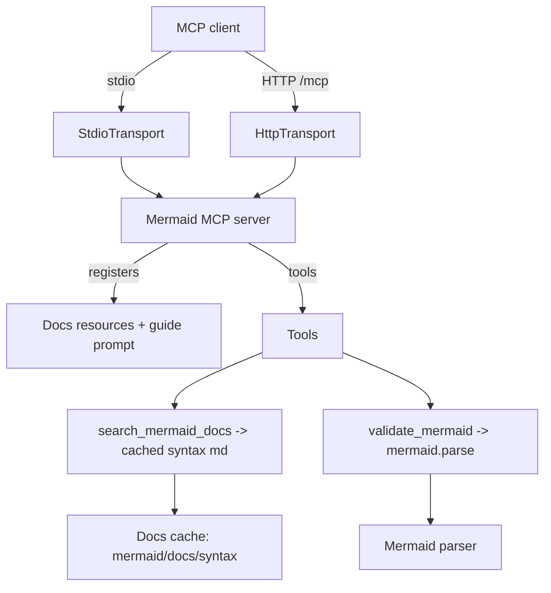
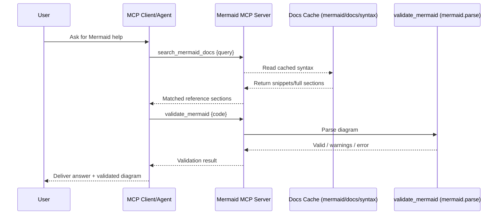

# Mermaid MCP Server

Model Context Protocol server that bundles the official Mermaid syntax docs and a syntax validator so agents can search, quote, and check diagrams before sending them to users.

## What It Does
- Serves Mermaid syntax Markdown as MCP resources (flowchart, sequence, class, C4, etc.) plus a `guide` prompt for quick routing.
- `search_mermaid_docs` finds sections in the bundled docs (`mermaid/docs/syntax`) with optional diagram filtering and snippet/full modes. Results come from a startup cache for speed.
- `validate_mermaid` runs `mermaid.parse` to flag syntax issues; DOM-related errors are treated as pass-through so headless environments still work.

## Architecture


## Install & Run
- Prereq: Node 18+
- Install: `npm install`
- Build: `npm run build`
- Start (STDIO for MCP clients): `npm run start:stdio`
- Start (HTTP for testing): `npm run start:http` (health at `/health`, MCP endpoint at `/mcp`)

## MCP Client Wiring (STDIO)
```json
{
  "mcpServers": {
    "mermaid": {
      "command": "node",
      "args": ["/absolute/path/to/mcp-mermaid/dist/server.js"]
    }
  }
}
```

## Agent Usage Tips
- Always search first: `search_mermaid_docs` with a single-term query (e.g., `flowchart`, `subgraph`, `arrow`); use `diagram_type` to narrow by file; `mode: "full"` returns entire docs.
- Always validate after editing: `validate_mermaid` on the final diagram string.
- Use the `guide` prompt for quick diagram-type routing and common pitfalls.

## Tests
- Run unit tests: `npm test`

## Project Layout
- `src/server.ts` – MCP server, resources, tools, docs cache
- `src/httpServer.ts` – Express HTTP wrapper for `/mcp`
- `guides/` – `guide.md` prompt and config
- `mermaid/docs/syntax/` – Bundled official Mermaid syntax Markdown
- `dist/` – Built JS output

## Request Flow (User → Answer)

