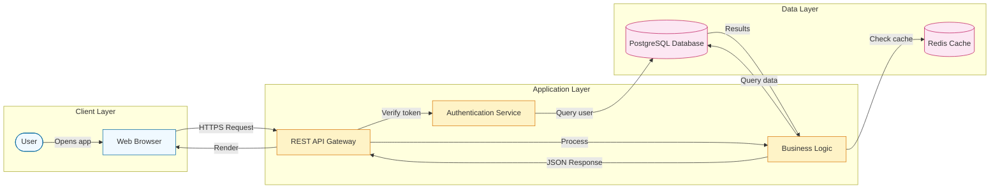

# Mermaid Diagram Generation – Core Instructions

## MANDATORY: Always Validate Before Presenting

**CRITICAL:** Call `validate_mermaid` on ALL diagrams before showing to users. Never skip validation.

## Standard Workflow

**Creating new diagrams:**
1. Choose appropriate diagram type (flowchart, sequence, class, etc.)
2. Use `search_resource` to find syntax and examples from official Mermaid docs
3. Build diagram with descriptive, human-readable node names (e.g., `UserService` not `US`)
4. Use modern features: subgraphs for grouping, classDef for styling, labeled edges for clarity
5. Call `validate_mermaid` (REQUIRED)
6. Fix errors if needed and re-validate

**Modifying existing diagrams:**
1. Read existing diagram
2. Use `validate_mermaid` to identify issues
3. Use `search_resource` for correct syntax from official docs
4. Apply fixes with improved readability
5. Call `validate_mermaid` again (REQUIRED)

## Available Tools

1. **`validate_mermaid`** - REQUIRED: Verify syntax before presenting to users
2. **`search_resource`** - Search official Mermaid documentation for syntax patterns and examples

## Diagram Type Selection

### Flow/Process
- **Flowchart** - Workflows, algorithms, decision trees
- **Sequence Diagram** - Interactions over time between actors/systems
- **State Diagram** - Lifecycle and state transitions
- **User Journey** - User steps and touchpoints

### Structure/Architecture
- **Class Diagram** - OO design, classes and relations
- **ER Diagram** - Database entities and relationships
- **C4/Architecture/Block** - System architecture, services, components

### Data Visualization
- **Pie** - Parts of a whole
- **XY/Line/Bar** - Trends, time series, numeric comparison
- **Quadrant** - 2x2 matrices
- **Sankey** - Flows between nodes
- **Treemap** - Hierarchical values
- **Radar** - Multi-dimensional comparison

### Planning/Timeline
- **Gantt** - Project tasks and dependencies
- **Timeline** - Milestones and historical events
- **Kanban** - Task boards (To Do/Doing/Done)

### Special
- **Git Graph** - Commits, branches, merges
- **Mindmap** - Hierarchical ideas
- **Requirement/Packet/ZenUML** - Requirements, network packets, alternate sequence syntax

**Default:** Use flowchart for processes, block/architecture diagram for systems.

## Syntax Reference

Use MCP tools to search the official Mermaid documentation:
- `search_resource({ query: "flowchart syntax" })` - Search across all Mermaid documentation files
- `get_examples({ diagramType: "sequenceDiagram" })` - Get working examples

The search returns matching lines with surrounding context from the official Mermaid docs.

## Validation Protocol

**Before returning ANY diagram:**

```javascript
validate_mermaid({ code: "FULL DIAGRAM SOURCE HERE" })
```

**If validation fails:**
1. Read error message
2. Use `search_resource` for correct syntax
3. Fix the diagram
4. Run `validate_mermaid` again
5. Repeat until validation passes

**Only return diagrams that pass validation.**

## Critical Syntax Rules

### Quote Complex Labels
Quote labels containing spaces, `+`, `,`, `:`, `/`, `(`, `)`, etc.
Applies to node labels, subgraph titles, and edge labels.

```mermaid
A["Agent (Planner + Orchestrator)"]
subgraph MCPLayer["MCP Layer\n(Model Context Protocol)"]
A -->|"tool invocation / calls"| B
```

### Reserved Words
Don't use bare reserved words like `end` as nodes.

```mermaid
End
or
endNode["end"]
```

### classDef Styling
Use colons, not equals:

```mermaid
classDef highlight fill:#e3f2fd,stroke:#1e88e5,stroke-width:2px;
class RAG highlight;
```

### Balanced Quotes and Brackets
Check that all `[]`, `{}`, `()`, and `"` are balanced before validation.

## Layout Guidelines

- Choose direction (`LR`, `RL`, `TB`, `BT`) to optimize diagram dimensions
- Use subgraphs to group related nodes
- Use invisible edges (`A ~~~ B`) for spacing
- Prefer descriptive but concise node names

## Best Practices for Modern, Professional Diagrams

### Use Human-Readable Names
- Full words over abbreviations: `UserAuthenticationService` not `UAS`
- Descriptive labels: `["API Gateway\n(Load Balancer)"]` provides context
- Clear participants: `participant Frontend as "React Application"`

### Leverage Modern Features
- **Subgraphs with titles**: Group components by layer or domain
  ```mermaid
  subgraph Backend["Backend Services"]
      API[REST API]
      DB[(Database)]
  end
  ```
- **classDef styling**: Color-code by type, layer, or importance
  ```mermaid
  classDef frontend fill:#e1f5ff,stroke:#01579b
  classDef backend fill:#fff3e0,stroke:#e65100
  class UI,Client frontend
  class API,Auth backend
  ```
- **Labeled edges**: Show data flow or interaction type
  ```mermaid
  User -->|"HTTP POST /api/login"| API
  API -->|"JWT token"| User
  ```
- **Node shapes**: Use appropriate shapes for semantics
  - `[(Database)]` for data stores
  - `([User])` for actors
  - `{{Decision}}` for decision points
  - `[/Input/]` or `[\Output\]` for I/O

### Backward Compatibility
- Stick to stable diagram types: `flowchart`, `sequenceDiagram`, `classDiagram`, `stateDiagram-v2`
- Avoid beta features (`-beta` suffix) in production diagrams
- Test complex diagrams with `validate_mermaid` before committing

### Example: Professional Flowchart


## Behavior Principles

- **Preserve intent** - Keep original logical flow when fixing diagrams
- **Be explicit** - Explain syntax and structural changes
- **Use search_resource** - Query official docs instead of guessing syntax
- **Human-readable names** - Use descriptive variable and node names
- **Modern features** - Leverage subgraphs, styling, and labeled edges for clarity

## Quick Reference

**Complete workflow for any Mermaid task:**
1. Choose diagram type (use `list_diagram_types`)
2. Search for syntax (use `search_resource`)
3. Get examples (use `get_examples`)
4. Build/modify diagram
5. **VALIDATE (REQUIRED)** - Call `validate_mermaid`
6. Fix errors using error messages + `search_resource`
7. **RE-VALIDATE** after fixes
8. Present to user only after validation passes

**Best practices:**
- Validate before presenting (mandatory)
- Build incrementally, validate frequently
- Use comments (`%% comment`) for documentation
- Use clear, meaningful node identifiers
- Use subgraphs for organization
- Search first, don't guess syntax
