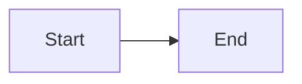

# Mermaid Diagram Guide

Use this guide to quickly understand which Mermaid diagram type to use. For detailed syntax, search the `syntax-reference` resource.

---

## 🎯 Choosing the Right Diagram

### **Flow & Process Diagrams**

**When to use:**
- General workflows and processes
- Decision trees and algorithms
- System flows

**Diagram Types:**
- **Flowchart** → Most versatile, use for general processes
- **Sequence Diagram** → Show interactions between actors/systems over time
- **State Diagram** → Model state transitions and lifecycles
- **User Journey** → Map user experiences and touchpoints

---

### **Structure & Relationships**

**When to use:**
- Software architecture
- Data models
- System components

**Diagram Types:**
- **Class Diagram** → Object-oriented design, show classes and relationships
- **ER Diagram** → Database schemas, entity relationships
- **C4 Diagram** → Software architecture at different zoom levels
- **Architecture Diagram** → System architecture with services and groups
- **Block Diagram** → Simple block-based layouts

---

### **Data Visualization**

**When to use:**
- Present metrics and analytics
- Compare data points
- Show distributions

**Diagram Types:**
- **Pie Chart** → Show proportions (parts of a whole)
- **XY Chart** → Plot coordinate data, trends over time
- **Quadrant Chart** → 2x2 prioritization matrices
- **Sankey Diagram** → Flow quantities between nodes
- **Treemap** → Hierarchical data with area sizes
- **Radar Chart** → Multi-dimensional comparisons

---

### **Planning & Timeline**

**When to use:**
- Project management
- Historical sequences
- Schedule tracking

**Diagram Types:**
- **Gantt Chart** → Project schedules with tasks and dependencies
- **Timeline** → Historical events or milestones
- **Kanban** → Task boards with columns

---

### **Specialized Use Cases**

- **Git Graph** → Visualize git commits, branches, merges
- **Mindmap** → Brainstorming, hierarchical concepts
- **Requirement Diagram** → Requirements engineering
- **Packet Diagram** → Network packet structures
- **ZenUML** → Alternative sequence diagram syntax

---

## 🚀 Quick Start

### 1. **Basic Structure**

All Mermaid diagrams start with a diagram type:

### 2. **Search for Syntax**

Use `search_resource` to find specific syntax:
- Search for "flowchart arrows" to find arrow types
- Search for "sequence notes" to add notes
- Search for "class relationships" for UML connections

### 3. **Validate Before Rendering**

Use `validate_mermaid` tool to check syntax before using:
- Catches syntax errors
- Identifies invalid node names
- Checks for balanced brackets/quotes

---

## ⚠️ Common Issues & Solutions

### **Syntax Errors**

1. **Reserved word "end"**
   - ❌ `flowchart LR\n    start --> end`
   - ✅ `flowchart LR\n    start --> End` or `start --> [end]`

2. **Special characters in labels**
   - ❌ `A --> B[Hello: World]`
   - ✅ `A --> B["Hello: World"]`

3. **Missing quotes for complex labels**
   - Use quotes for labels with spaces, colons, or special chars
   - Use backticks for markdown formatting: `` ["`**Bold** text`"] ``

### **Visual Issues**

1. **Diagram too wide/tall**
   - Change direction: `LR`, `RL`, `TB`, `BT`
   - Use subgraphs to organize

2. **Overlapping nodes**
   - Add more spacing in your structure
   - Use invisible edges: `A ~~~ B`

3. **Labels not showing**
   - Check for balanced quotes
   - Verify no special characters without escaping

---

## 🔧 Tools Available

1. **`validate_mermaid`** - Check syntax and catch errors
2. **`search_resource`** - Find syntax patterns in reference
3. **`list_diagram_types`** - See all available diagram types
4. **`get_examples`** - Get working examples for specific diagram types

---

## 📋 Quick Reference Cheat Sheet

### Flowchart Directions
- `LR` = Left to Right
- `TB`/`TD` = Top to Bottom
- `RL` = Right to Left
- `BT` = Bottom to Top

### Common Node Shapes
- `[Text]` = Rectangle
- `(Text)` = Rounded
- `{Text}` = Diamond
- `((Text))` = Circle
- `[(Text)]` = Database

### Arrow Types
- `-->` = Solid arrow
- `-.->` = Dotted arrow
- `==>` = Thick arrow
- `---` = Line (no arrow)

### Sequence Messages
- `->>` = Solid with arrow
- `-->>` = Dotted with arrow
- `-)` = Async (no arrow)
- `-x` = Cross end

---

## 💡 Best Practices

1. **Start Simple** - Build incrementally, test often
2. **Use Comments** - Add `%% comment` for documentation
3. **Consistent IDs** - Use clear, meaningful node identifiers
4. **Group Related** - Use subgraphs/sections for organization
5. **Search First** - Use `search_resource` to find syntax quickly
6. **Validate Often** - Run `validate_mermaid` before finalizing

---

## 🔍 How to Work

1. **Choose diagram type** - Use routing above
2. **Search for syntax** - `search_resource({query: "your need"})`
3. **Build incrementally** - Start with core structure
4. **Validate** - Use `validate_mermaid` to check
5. **Refine** - Add styling and details
6. **Fix issues** - Use validation errors to debug

---

**Need help?** Search the reference resource or use the validation tool to identify issues!
