# Mermaid Syntax Reference

Complete syntax reference for all Mermaid diagram types. Use `search_resource` to quickly find specific syntax patterns.

---

## ⚠️ CRITICAL VALIDATION REQUIREMENT

**BEFORE presenting ANY Mermaid diagram to users:**

1. **MUST** call `validate_mermaid` tool with the complete diagram code
2. **MUST** fix any validation errors before showing the diagram
3. **MUST** re-validate after making any corrections

**Invalid diagrams will fail to render and frustrate users. Always validate!**

---

## 🎯 Quick Navigation

**Flow & Process:**
- [Flowchart](#flowchart) - General purpose diagrams with nodes and edges
- [Sequence Diagram](#sequence-diagram) - Message flows between actors
- [State Diagram](#state-diagram) - State transitions and lifecycles
- [Gantt Chart](#gantt-chart) - Project timelines and schedules
- [User Journey](#user-journey) - User experience flows

**Structure & Organization:**
- [Class Diagram](#class-diagram) - Object-oriented structures
- [ER Diagram](#er-diagram) - Entity relationships (databases)
- [C4 Diagram](#c4-diagram) - Software architecture contexts
- [Architecture Diagram](#architecture-diagram) - System architectures
- [Block Diagram](#block-diagram) - Block-based structures

**Data & Analysis:**
- [Pie Chart](#pie-chart) - Proportional data
- [XY Chart](#xy-chart) - Coordinate data
- [Quadrant Chart](#quadrant-chart) - 2x2 matrices
- [Sankey Diagram](#sankey-diagram) - Flow quantities
- [Treemap](#treemap) - Hierarchical data
- [Radar Chart](#radar-chart) - Multi-dimensional data

**Specialized:**
- [Git Graph](#git-graph) - Git commit history
- [Mindmap](#mindmap) - Hierarchical thinking
- [Timeline](#timeline) - Historical events
- [Requirement Diagram](#requirement-diagram) - Requirements engineering
- [Packet Diagram](#packet-diagram) - Network packets
- [Kanban](#kanban) - Kanban boards
- [ZenUML](#zenuml) - Alternative sequence diagrams

---

## Flowchart

### Basic Syntax

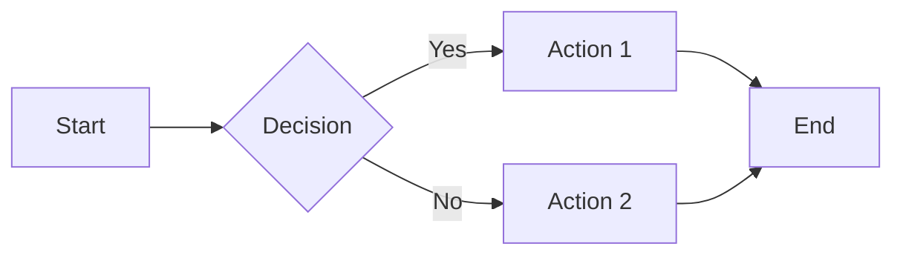

### Directions
- `LR` - Left to Right
- `RL` - Right to Left
- `TB` or `TD` - Top to Bottom
- `BT` - Bottom to Top

### Node Shapes

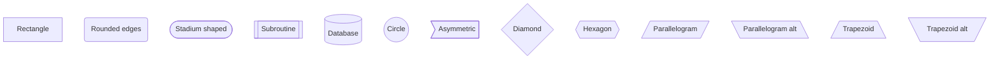

### Arrow Types

```mermaid
flowchart LR
    A --> B    %% Solid arrow
    C --- D    %% No arrow
    E -.-> F   %% Dotted arrow
    G ==> H    %% Thick arrow
    I --o J    %% Circle end
    K --x L    %% Cross end
```

### Labels on Arrows

```mermaid
flowchart LR
    A -->|text| B
    C --|text|-> D
```

### Subgraphs

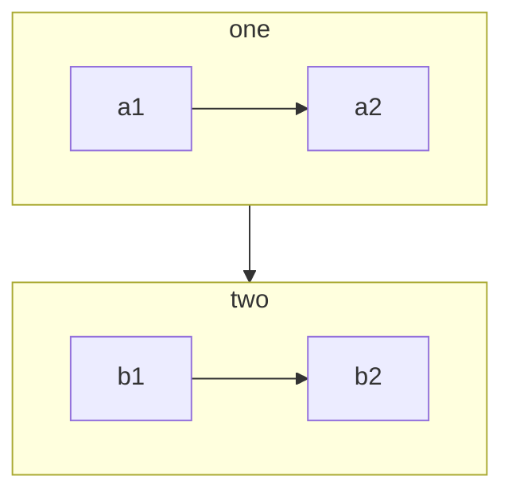

### Styling

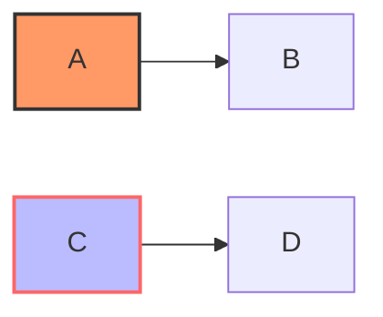

---

## Sequence Diagram

### Basic Syntax

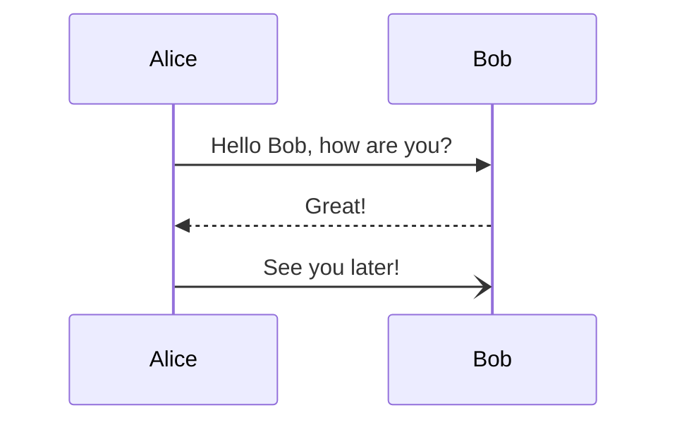

### Message Types

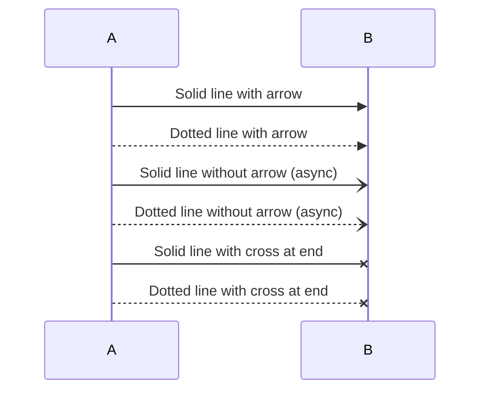

### Activations

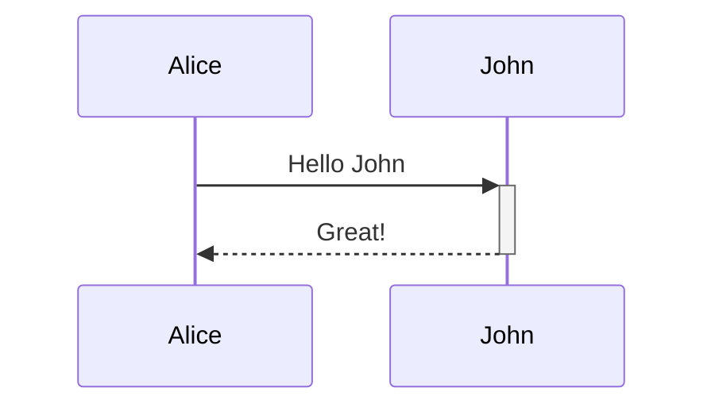

### Notes

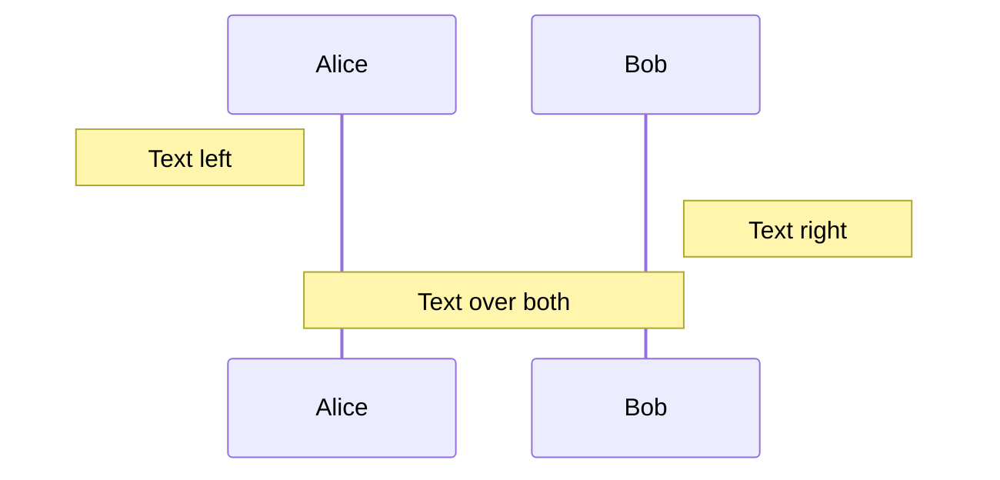

### Loops

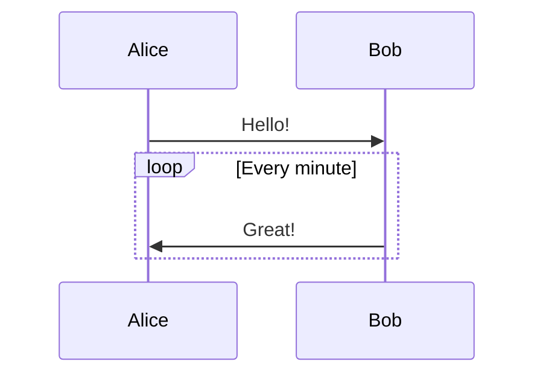

### Alt/Else

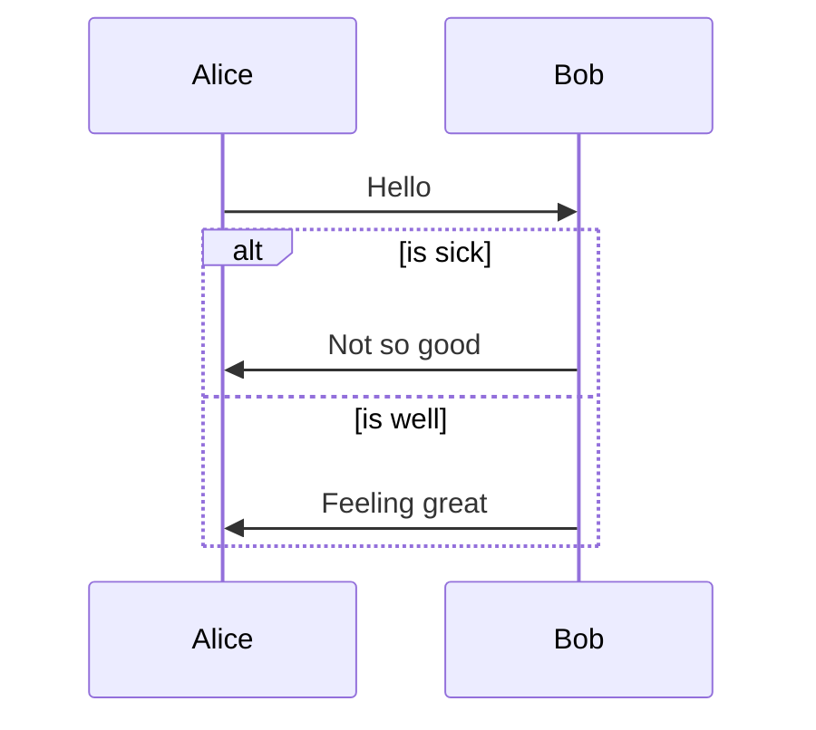

### Par (Parallel)

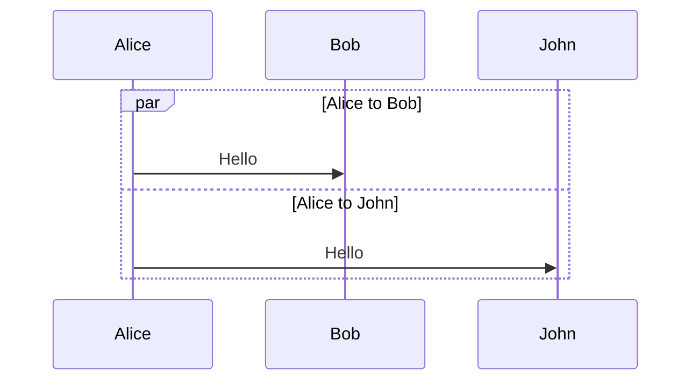

### Critical Region

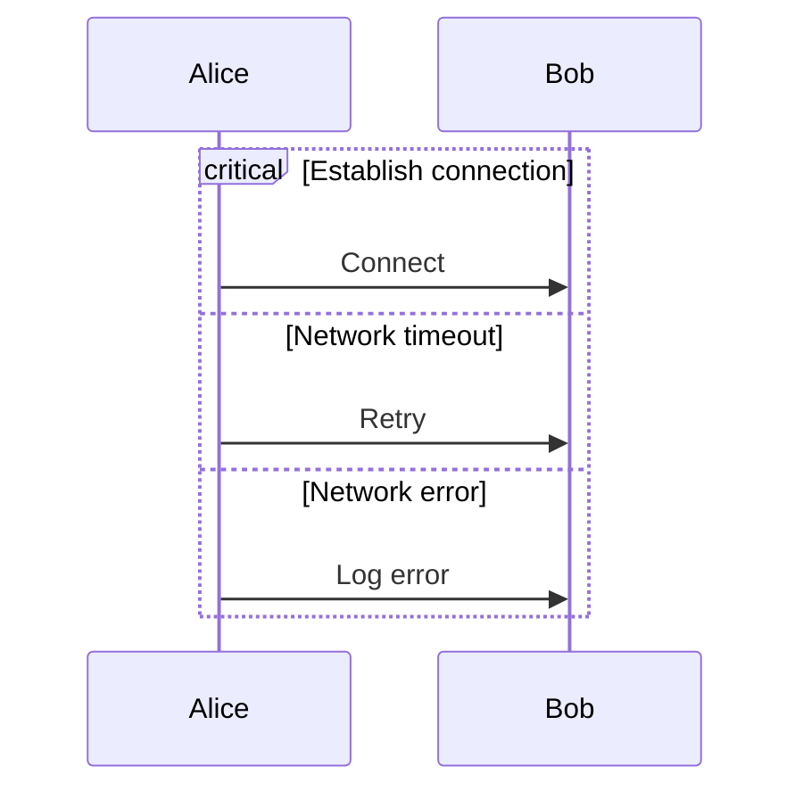

### Background Highlighting

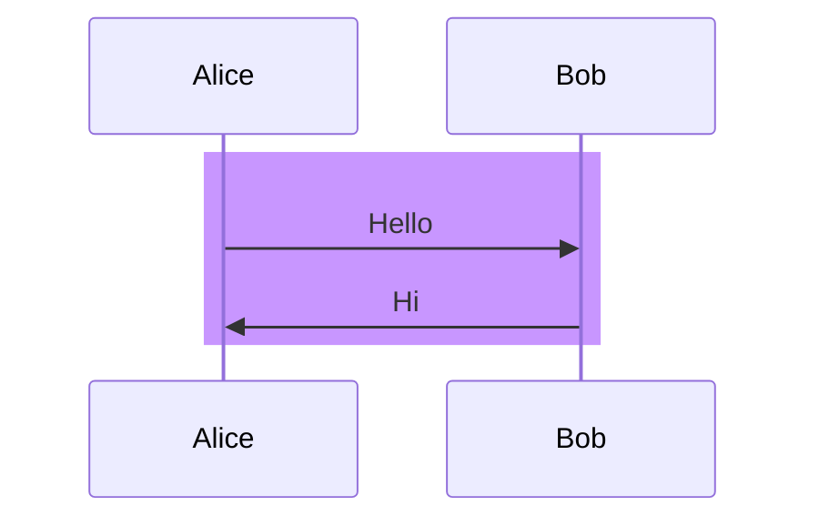

---

## Class Diagram

### Basic Syntax

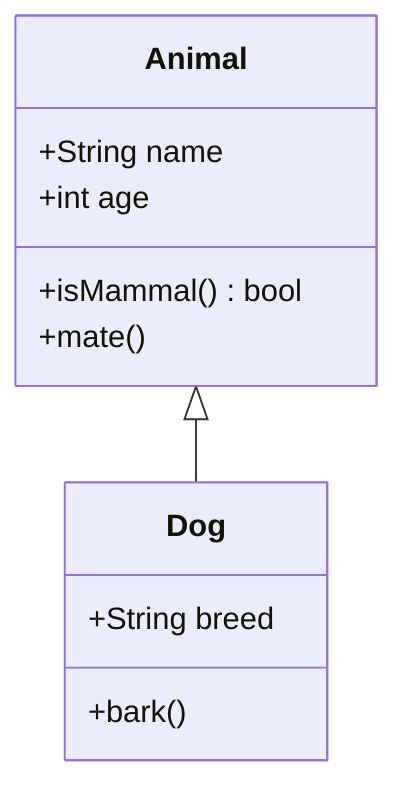

### Visibility

- `+` Public
- `-` Private
- `#` Protected
- `~` Package/Internal

### Relationships

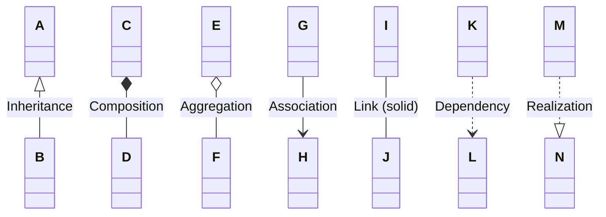

### Relationship Labels

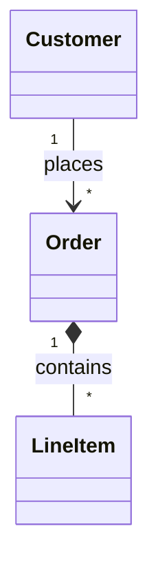

### Annotations

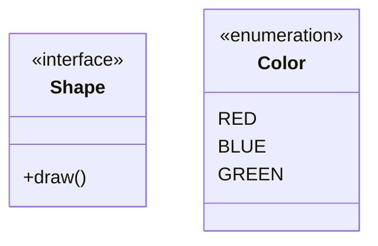

---

## State Diagram

### Basic Syntax

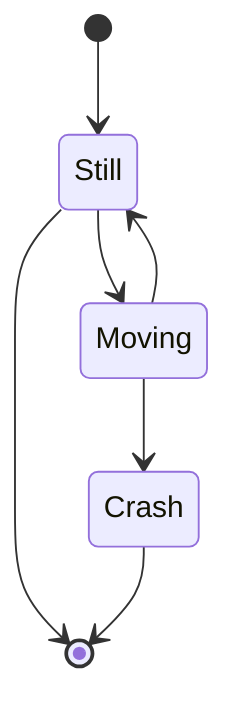

### Composite States

```mermaid
stateDiagram-v2
    [*] --> First
    
    state First {
        [*] --> Second
        Second --> Third
        Third --> [*]
    }
    
    First --> [*]
```

### Choice

```mermaid
stateDiagram-v2
    state if_state <<choice>>
    [*] --> IsPositive
    IsPositive --> if_state
    if_state --> False: if n < 0
    if_state --> True : if n >= 0
```

### Forks

```mermaid
stateDiagram-v2
    state fork_state <<fork>>
    [*] --> fork_state
    fork_state --> State2
    fork_state --> State3
    
    state join_state <<join>>
    State2 --> join_state
    State3 --> join_state
    join_state --> State4
    State4 --> [*]
```

### Notes

```mermaid
stateDiagram-v2
    State1 --> State2
    note right of State1
        Important note here
    end note
```

### Concurrency

```mermaid
stateDiagram-v2
    [*] --> Active
    
    state Active {
        [*] --> NumLockOff
        NumLockOff --> NumLockOn : EvNumLockPressed
        NumLockOn --> NumLockOff : EvNumLockPressed
        --
        [*] --> CapsLockOff
        CapsLockOff --> CapsLockOn : EvCapsLockPressed
        CapsLockOn --> CapsLockOff : EvCapsLockPressed
    }
```

---

## ER Diagram

### Basic Syntax

```mermaid
erDiagram
    CUSTOMER ||--o{ ORDER : places
    ORDER ||--|{ LINE-ITEM : contains
    CUSTOMER }|..|{ DELIVERY-ADDRESS : uses
```

### Relationships

- `||--||` One to one
- `||--o{` One to many
- `}o--o{` Many to many
- `||..|{` One to many (identifying)

### Relationship Types

- `||` Exactly one
- `|o` Zero or one
- `}o` Zero or many
- `}|` One or many

### Attributes

```mermaid
erDiagram
    CUSTOMER {
        string name
        string custNumber PK
        string sector
    }
    ORDER {
        int orderNumber PK
        string deliveryAddress FK
        date orderDate
    }
    CUSTOMER ||--o{ ORDER : places
```

### Attribute Keys

- `PK` Primary Key
- `FK` Foreign Key
- `UK` Unique Key

---

## Gantt Chart

### Basic Syntax

```mermaid
gantt
    title A Gantt Diagram
    dateFormat YYYY-MM-DD
    section Section
        A task           :a1, 2024-01-01, 30d
        Another task     :after a1, 20d
    section Another
        Task in Another  :2024-01-12, 12d
        another task     :24d
```

### Date Formats

- `YYYY-MM-DD`
- `YYYY-MM-DD HH:mm`
- `HH:mm`

### Task Status

```mermaid
gantt
    title Task Status
    dateFormat YYYY-MM-DD
    
    Task1: done, t1, 2024-01-01, 2024-01-05
    Task2: active, t2, 2024-01-06, 3d
    Task3: t3, after t2, 5d
    Task4: crit, t4, 2024-01-14, 2d
    Task5: crit, done, t5, 2024-01-10, 3d
```

### Milestones

```mermaid
gantt
    dateFormat YYYY-MM-DD
    section Milestones
        Milestone 1: milestone, m1, 2024-01-15, 0d
        Milestone 2: milestone, m2, 2024-02-01, 0d
```

---

## Git Graph

### Basic Syntax

```mermaid
gitGraph
    commit
    commit
    branch develop
    checkout develop
    commit
    commit
    checkout main
    merge develop
    commit
```

### With Tags and Branches

```mermaid
gitGraph
    commit id: "Initial"
    commit id: "Feature A"
    branch develop
    commit id: "Dev work"
    checkout main
    commit id: "Hotfix" tag: "v1.0.1"
    checkout develop
    commit id: "More dev"
    checkout main
    merge develop tag: "v1.1.0"
```

### Commit Types

```mermaid
gitGraph
    commit id: "Normal"
    commit id: "Reverse" type: REVERSE
    commit id: "Highlight" type: HIGHLIGHT
```

---

## Mindmap

### Basic Syntax

```mermaid
mindmap
  root((Central Idea))
    Topic 1
      Subtopic 1.1
      Subtopic 1.2
    Topic 2
      Subtopic 2.1
      Subtopic 2.2
        Detail 2.2.1
```

### Node Shapes

```mermaid
mindmap
  root((Root))
    (Round node)
    [Square node]
    {{Hexagon node}}
    ))Cloud node((
```

### Icons

```mermaid
mindmap
  root((Project))
    ::icon(fa fa-book)
    Documentation
      ::icon(fa fa-file)
    Code
      ::icon(fa fa-code)
```

---

## Timeline

### Basic Syntax

```mermaid
timeline
    title History of Technology
    1970 : Unix created
    1983 : C++ released
    1991 : Linux kernel released
         : Python first released
    2000 : Cloud computing emerges
```

### Sections

```mermaid
timeline
    title Development Timeline
    section Planning
        2024-01 : Requirements gathering
        2024-02 : Design phase
    section Development
        2024-03 : Core features
        2024-04 : Testing
    section Launch
        2024-05 : Release
```

---

## Pie Chart

### Basic Syntax

```mermaid
pie title Pets adopted by volunteers
    "Dogs" : 386
    "Cats" : 85
    "Rats" : 15
```

### Show Data

```mermaid
pie showData
    title Key elements
    "Calcium" : 42.96
    "Potassium" : 50.05
    "Magnesium" : 10.01
```

---

## XY Chart

### Basic Syntax

```mermaid
xychart-beta
    title "Sales Revenue"
    x-axis [jan, feb, mar, apr, may, jun]
    y-axis "Revenue (in $)" 4000 --> 11000
    line [5000, 6000, 7500, 8200, 9500, 10500]
```

### Multiple Lines

```mermaid
xychart-beta
    title "Comparison"
    x-axis [Q1, Q2, Q3, Q4]
    y-axis "Values" 0 --> 100
    line "Series 1" [20, 40, 60, 80]
    line "Series 2" [30, 50, 70, 90]
    bar "Series 3" [25, 45, 65, 85]
```

---

## Quadrant Chart

### Basic Syntax

```mermaid
quadrantChart
    title Reach and engagement of campaigns
    x-axis Low Reach --> High Reach
    y-axis Low Engagement --> High Engagement
    quadrant-1 We should expand
    quadrant-2 Need to promote
    quadrant-3 Re-evaluate
    quadrant-4 May be improved
    Campaign A: [0.3, 0.6]
    Campaign B: [0.45, 0.23]
    Campaign C: [0.57, 0.69]
```

---

## Requirement Diagram

### Basic Syntax

```mermaid
requirementDiagram
    requirement test_req {
        id: 1
        text: the test text.
        risk: high
        verifymethod: test
    }
    
    element test_entity {
        type: simulation
    }
    
    test_entity - satisfies -> test_req
```

### Relationships

- `contains`
- `copies`
- `derives`
- `satisfies`
- `verifies`
- `refines`
- `traces`

---

## C4 Diagram

### Context Diagram

```mermaid
C4Context
    title System Context diagram for Internet Banking System
    
    Person(customer, "Customer", "A customer of the bank")
    System(banking, "Internet Banking", "Allows customers to view info")
    System_Ext(email, "Email System", "The internal email system")
    
    Rel(customer, banking, "Uses")
    Rel(banking, email, "Sends emails using")
```

### Container Diagram

```mermaid
C4Container
    title Container diagram for Internet Banking System
    
    Person(customer, "Customer")
    
    Container(web_app, "Web Application", "Java, Spring MVC", "Delivers content")
    Container(spa, "Single-Page App", "JavaScript, Angular", "Provides banking UI")
    ContainerDb(database, "Database", "SQL Database", "Stores user info")
    
    Rel(customer, web_app, "Uses", "HTTPS")
    Rel(web_app, database, "Reads/Writes", "JDBC")
```

---

## Architecture Diagram

### Basic Syntax

```mermaid
architecture-beta
    group api(cloud)[API Layer]
    
    service server(server)[Server] in api
    service db(database)[Database] in api
    
    server:R --> L:db
```

---

## Block Diagram

### Basic Syntax

```mermaid
block-beta
    columns 3
    A["Block A"] B["Block B"] C["Block C"]
    D["Block D"] E["Block E"] F["Block F"]
```

### With Arrows

```mermaid
block-beta
    columns 3
    A space B
    C --> D
    D --> E
```

---

## Sankey Diagram

### Basic Syntax

```mermaid
sankey-beta
    Agricultural 'waste',Bio-conversion,124.729
    Bio-conversion,Losses,26.862
    Bio-conversion,Solid,280.322
    Bio-conversion,Gas,81.144
```

---

## Treemap

### Basic Syntax

```mermaid
treemap
    title Product Sales
    Electronics: 450
      Phones: 200
      Laptops: 150
      Tablets: 100
    Clothing: 300
      Shirts: 120
      Pants: 100
      Shoes: 80
```

---

## Radar Chart

### Basic Syntax

```mermaid
radar
    title Skills Assessment
    "Communication": 8
    "Problem Solving": 9
    "Technical": 7
    "Leadership": 6
    "Creativity": 8
```

---

## Packet Diagram

### Basic Syntax

```mermaid
packet-beta
    0-7: "Header"
    8-15: "Type"
    16-31: "Length"
    32-63: "Data"
```

---

## Kanban

### Basic Syntax

```mermaid
kanban
    Todo
        Task 1
        Task 2
    In Progress
        Task 3
    Done
        Task 4
        Task 5
```

---

## ZenUML

### Basic Syntax

```mermaid
zenuml
    Alice->Bob: Hello
    Bob->Alice: Hi
```

---

## Common Configuration

### Theme

```mermaid
%%{init: {'theme':'dark'}}%%
flowchart LR
    A-->B
```

Available themes: `default`, `dark`, `forest`, `neutral`, `base`

### Direction (for most diagrams)

```
%%{init: {'flowchart': {'rankDir': 'LR'}}}%%
```

---

## Common Pitfalls

1. **Reserved Word "end"**: Capitalize or use brackets: `[end]`, `(end)`, or `"end"`
2. **Special Characters**: Use quotes for labels with special chars: `A["Label: Value"]`
3. **Line Breaks**: Use `<br/>` in labels for HTML or backticks for markdown
4. **Comments**: Use `%%` for comments in any diagram
5. **Semicolons**: Optional but can help with complex diagrams

---

## Quick Tips

- Always test complex diagrams incrementally
- Use subgraphs/sections to organize large diagrams
- Consistent naming conventions help readability
- Check for balanced brackets and quotes
- Validate syntax before styling
